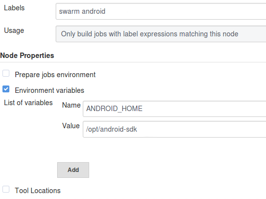

# Android Build and CI Toolchain for Jenkins

Setup for a Build and Continuous Integration Toolchain for Android Projects using Jenkins.  
This setup is using a dedicated Build Node in a Jenkins Cluster for better performance and priorization. Sonar and JaCoCo integration is included in the Jenkins Job file.
Publishing the .apk on the Play Store is automatically done for the Alpha track of the project.  

## Setup

For this setup a dedicated Node was used, but it can easily be done on the Jenkins Master.  
The required plugins can be found [here](#plugins).

### SDK

Download the latest SDK tools [here](https://developer.android.com/studio/#downloads)

  ~~~sh
  cd /opt
  $ sudo wget ANDROID_SDK.zip
  $ sudo unzip ANDROID_SDK.zip -d android-sdk
  $ sudo chown -R JENKINS_USER:JENKINS_USER android-sdk
  ~~~

### Node Configuration:  

If a dedicated node is used for Android projects, add an 'android' label and set the usage to exclusive.  
Set `ANDROID_HOME` as an environment variable pointing to your Android SDK.  

 
## Plugins

[Self-Organizing Swarm Modules](https://plugins.jenkins.io/swarm)

[Google Play Publisher](https://plugins.jenkins.io/google-play-android-publisher)

[DSL](https://plugins.jenkins.io/job-dsl)

[Android Emulator](https://plugins.jenkins.io/android-emulator)
## Job Configuration

Configuration can be found in `android.groovy`.  
The following variables need to be set:

  ~~~ groovy
  generalJenkinsSSHKeyUUID  
  gitlabBaseUrl  
  gitlabUrl  
  jdkInstallation // JDK Installation, e.g. Oracle JDK 8  
  mailingList // all mail adresses that shall receive a notification  
  sonarInstallation //Name of the Sonar Installation Instace used by Jenkins for this project  
  ~~~

Repositories are added using the repo array variable.  
Example: 

  ~~~ groovy
  def repos = [
          'chess-app'           : [
                  repo: 'mobile/chess-android',
                  mailer: mailingList,
                  view: 'android',
                  devicetest: true,
                  coverage: true,
                  packageId: 'de.synyx.mobile.chess',
                  deployments: [
                          [
                                  name:'chess-app-prod-deploy',
                                  apk:'release/app-release.apk'
                          ],
                  ],
          ]
  ]
  ~~~

For further configuration, see: [Job DSL Doc](https://jenkinsci.github.io/job-dsl-plugin)

## Configuring AVD

This requires the aforementioned Android Emulator Plugin.  

By default the job will create a parameterized AVD during its runtime and destroyed afterwards. See [below](#avd-parameter) for the configuration.  
Possible configurations include using different AVDs for different jobs and reusing them.  
  

### AVD Parameter

  ~~~ groovy
  androidEmulator {
    avdName('foo')
    osVersion(null)
    screenDensity(null)
    screenResolution(null)
    deviceLocale(null)
    sdCardSize(null)
    wipeData(false)
    showWindow(false)
    useSnapshots(false)
    deleteAfterBuild(false)
    startupDelay(0)
    startupTimeout(0)
    commandLineOptions('')
    targetAbi(null)
    executable('')
    avdNameSuffix(null)
  }
  ~~~

`showWindow(false)` is the equivalent of the `-no-window` parameter parameter.

## ToDo

* Complete Docker Setup
* Redo README
